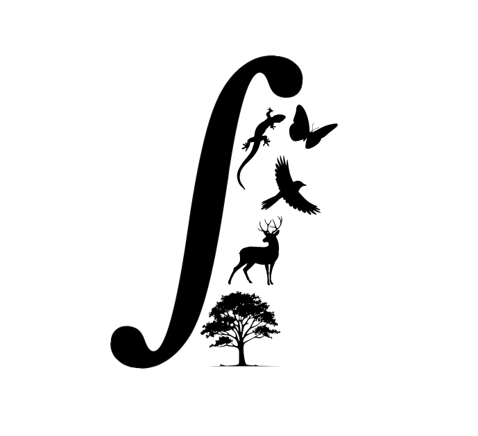

<p style="font-size:12pt">

In a context of ongoing climate change increasing human pressure and biodiversity loss, it is of crucial importance to adopt an **integrative approach to support biodiversity conservation**. The main objective of **INTEGRADIV**  (Biodiversa + project - 2023-2026) is to develop such an innovative approach to provide guidelines on [how taxonomic, functional and phylogenetic facets of biodiversity should be encapsulated in realistic conservation plans of Euro-Mediterranean forests]{style="color: olivedrab;"}.

More specifically, through four work packages led by different partners (cf [INTEGRADIV website](https://www.integradiv-biodiversa.org/) to know more about the project's partners), **INTEGRADIV aims to understand**:

  - [Where are the present-day high-value biodiversity area in Euro-Mediterranean forests?]{style="color: olivedrab;"}
  - [How are diversity patterns shaped in Euro-Mediterranean forests?]{style="color: olivedrab;"}
  - [How is diversity expected to change in a near future? Where to prioritize conservation, with stakeholders' help?]{style="color: olivedrab;"}


On [this webpage](  https://www.integradiv-biodiversa.org/ressources4stakeholders) you can find a video explaining the oevrall aims of this project.


This website explains the main framework of this project, and gathers the [main outputs of this project]{style="color: olivedrab;"} in three parts (_cf_ website tabs):

  - **Current Hotspots of diversity Euro-Mediterranean forests** 
  - **Drivers of Diversity in Euro-Mediterranean forests**
  - **Future diversity forecast** and **Prioritisation**


```{r, layout="l-screen-inset", fig.cap="Diversity of Mediterranean forests", echo=FALSE}



```

```{r, layout="l-screen-inset", fig.cap="Diversity of Mediterranean forests", echo=FALSE}

knitr::include_graphics("images/bandeau_foret_med.jpg")

```

