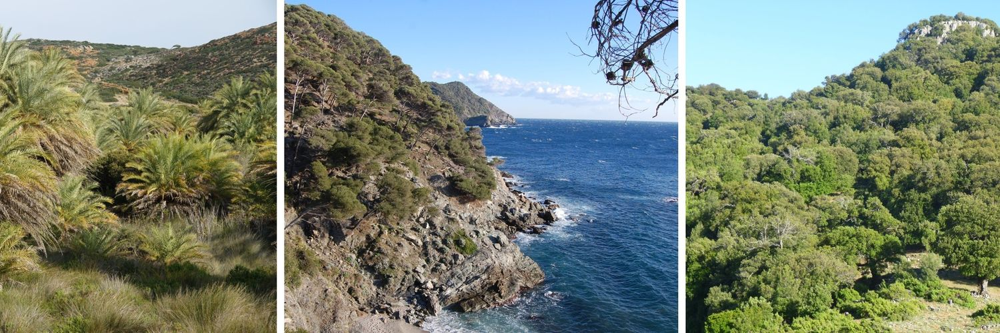

```{r, layout="l-screen-inset", fig.cap="Diversity of Mediterranean forests", echo=FALSE}



```

<aside>

```{r, echo=FALSE}
library(ggimage)
library(ggplot2)

df.img <- data.frame(x = 1, y = 1, img = "images/INTEGRADIV_logo_5_taxa.png")

ggplot(df.img, aes(x = x, y = y )) + geom_image(aes(image=img), size=0.9, asp = 1) +
  theme_void() +
  theme(
    panel.background = element_rect(fill = "#FAF8F4", color = "#FAF8F4"), 
    plot.background = element_rect(fill = "#FAF8F4", color = "#FAF8F4")
  )
```

</aside>

<p style="font-size:10pt">

In a context of ongoing climate change, increasing human pressure and biodiversity loss, it is of crucial importance to adopt an integrative approach to support the biodiversity conservation. The main objective of INTEGRADIV is to develop such an innovative approach to provide guidelines on how taxonomic, functional and phylogenetic facets of biodiversity should be encapsulated in realistic conservation plans.
